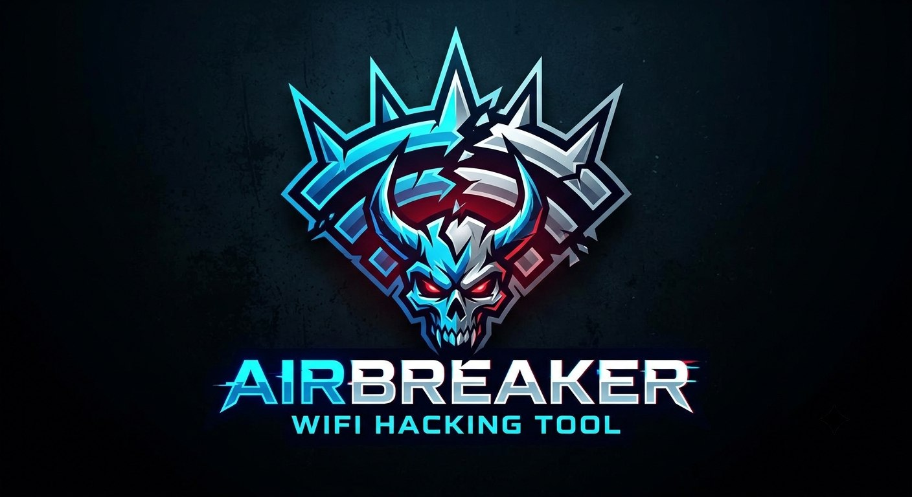

<h1 align="center">AirBreaker</h1>
<p align="center">Wi-Fi Security Framework</p>

<p align="center">
  
  
  
  
  
  
  
  
 <!--  -->
 <a href="LICENSE">
  
</a>
</p>

<p align="center">
  
</p>

## ⚠️ Disclaimer

This project is created strictly for **educational purposes** and **authorized security testing** (penetration testing).

The developer assumes no liability for any misuse, damage, or illegal activities caused by this tool.
Only use AirBreaker on networks you own or have explicit, written permission to test.

> **Status:** early development. Core scanning and WPA/WPA2 handshake capture work.
> Most attack modules are not yet implemented — see [Roadmap](#-roadmap).

## Why AirBreaker?

Most Wi-Fi security tools are wrappers around `airmon-ng`, `hcxdumptool`,
`hcxtools`, `mdk4` or `reaver`. AirBreaker is not.

All low-level operations go through standard Linux tools:

| Layer | Tool |
|-------|------|
| Monitor mode, channel control, interface info | `iw` |
| Link up/down, interface state | `ip` |
| Available channel discovery | `iwlist` |

`nmcli` and `systemctl` are used **only to manage the host's network stack
around an attack** — disabling NetworkManager before capture and restoring
it afterwards. They are never part of the attack path itself.

All packet crafting, injection, and parsing is done in **pure Python + Scapy**.
No black boxes. No external attack binaries. Every step is visible in the source.

## Stack

| Layer | Technologies |
|-------|--------------|
| Backend | FastAPI, Scapy, asyncio |
| Frontend | Vue.js, Pinia, Chart.js *(planned)* |
| Infra | Docker, Docker Compose, Nginx, Linux |

## Quick start

> **Requirements:** Linux, a Wi-Fi adapter with monitor mode + injection support, root privileges.

```bash
git clone https://github.com/stanislavzxc/AirBreaker.git
cd AirBreaker

# Build the image
docker build -t airbraker_backend_image .

# Run the container 
docker run -d --network host --privileged --name airbreaker_backend --rm airbraker_backend_image
```

Then open the API docs at [http://localhost:5000/docs](http://localhost:5000/docs).

> The frontend (Vue.js + Pinia + Chart.js) is planned for a later phase.

## Project structure
```text
.
├── main.py              # FastAPI entry point
├── docker-compose.yaml  # Docker services configuration
├── deps/                # Custom DI for routers (REST + WS)
├── errors/              # Error handlers and exceptions
├── models/              # Pydantic schemas
├── routers/             # REST + WebSocket endpoints
├── service/             # Business logic layer
├── state.py             # Application state
└── utils/               # Network and system helpers
```

> A detailed structure is available in [`STRUCTURE.md`](STRUCTURE.md).

## 🗺️ Roadmap

### ✅ Done

- [x] FastAPI backend setup
- [x] Network card management
- [x] Monitor mode activation via `iw`
- [x] Wi-Fi scanning (beacon, data, EAPOL frames)
- [x] Channel hopping
- [x] WPA/WPA2 handshake capture
- [x] Targeted deauthentication attack
- [x] PMKID extraction from beacon frames

### 🔄 In Progress

- [ ] Multi-MAC deauthentication
- [ ] Broadcast deauthentication
- [ ] PMKID hash capture (without handshake)
- [ ] Hashcat / John the Ripper integration

### 📅 Planned

- Evil Twin — rogue AP, captive portal, credential harvesting, MITM.
- PMF (802.11w) — detection, downgrade attacks, bypass techniques.
- WPA3 / SAE — Dragonfly handshake capture, side-channel analysis, transition-mode attacks.
- Detection & Mitigation — deauth flood detection, evil twin detection, rogue AP detection, IDS integration.
- Reporting — automated pentest reports, CVSS scoring, pcap analysis, PDF/HTML export.
- Advanced exploitation — KRACK, FragAttacks, jamming, Wi-Fi 6E/7, SDR integration.

> A detailed, phase-by-phase plan lives in [`ROADMAP.md`](ROADMAP.md).


